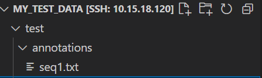
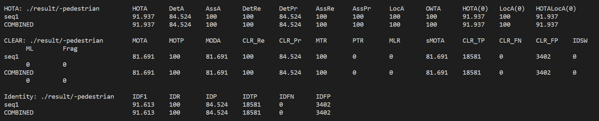

# Easier to use TrackEval

## I. Warehouse description

Given [TrackEval] (https://github.com/JonathonLuiten/TrackEval) library to write a little bit complicated, could not too friendly for beginners, so I want to a simple optimization makes it easier to evaluate custom data sets

The most important thing about running through code is the path, so I've written two config templates to make it easier to configure the path.

*** Only 2D MOT data sets are supported ***

## II. Usage method

### Directory structure

The directory structure of the general MOT dataset can be divided into two main categories (more on this later if there are others)** One is like the MOT Challenge (for example: UAVDT)**

```
# ${data_root}:
#    |
#    |___${train_folder_name}(Optional)
#          |
#          |____${seq_name}
#                     |_______${image_folder}
#                                    |____${frame_name}
#                     |_______${gt_folder_name}
#                                    |____${gt_txt_name}
#    |___${test_folder_name}(Optional)
#          |
#          |____${seq_name}
#                     |_______${image_folder}
#                                    |____${frame_name}
#                     |_______${gt_folder_name}   
#                                    |____${gt_txt_name}
```

For example, if my MOT17 dataset is under '/data/datasets/', the value is:
```
data_root: /data/datasets/MOT17

train_folder_name: train, # Trainset folder name
seq_name: MOT17-02-DPM, ... MOT17-13-SDP, # Sequence name
image_folder: img1, # The name of the folder where the sequence frames are stored
frame_name: 000001.jpg... , 000600.jpg, ...  , # picture name
gt_folder_name: gt # True folder name
gt_txt_name: gt.txt # Name of the truth file

test_folder_name: test
... Ditto

```

Of course, some datasets do not separate the training set from the test set, so train_folder_name, train_folder_name can also be absent, such as the UAVDT dataset.


** The other is similar to the yolo format: (e.g., Visdrone)**

```
# ${data_root}:
#    |
#    |___${train_folder_name}(Optional)
#          |
#          |____${seq_folder_name}
#          |          |_______${seq_name}
#          |                         |____${frame_name}
#          |____${gt_folder_name}
#                     |____${gt_txt_name}
#    |___${test_folder_name}(Optional)
#          |
#          |____${seq_folder_name}
#          |          |_______${seq_name}
#          |                         |____${frame_name}
#          |____${gt_folder_name}
#                     |____${gt_txt_name}
```

For example, Visdrone's test set directory structure is as follows (the same goes for training sets and test sets):


In this directory structure, truth folders and sequence folders are horizontal rather than contained within a sequence. Therefore, for Visdrone, the value in the directory structure is as follows:

```
data_root: /data/datasets/VisDrone

train_folder_name: VisDrone2019-MOT-train, # Trainset folder name
seq_folder_name: sequences # Name of the folder where the sequences are stored
seq_name: uav0000013_00000_v, ... , # Sequence name
frame_name: 0000002.jpg... , 00000200.jpg, ...  , # picture name
gt_folder_name: annotations # True value folder name
gt_txt_name: {seq_name}.txt # Name of the truth file, related to the sequence name, written as a formatted string

test_folder_name: test
... Ditto
```

### All you do is to fill in!


You just need to follow these steps to set up:


1. Select the directory structure template for a dataset (' configs/template1.yaml 'or' configs/template2.yaml ') and fill in the corresponding value in 'gt_structure_config' according to the folder name of your dataset.

> Note that 'gt_loc_format' needs careful checking. It means to find a path to the truth value of a sequence. txt. This is a formatted string, and the variables inside are variables in 'gt_structure_config', so the names need to be consistent. If your data set is slightly different, you only need to modify this area.


To set additional information: Your dataset corresponds to:

Sequence information:

```
SEQ_INFO:
Sequence name: sequence length
```

Category name to be evaluated:

```
CLASSES_TO_EVAL:
- Category 1
- Category 2
-...
```

Mapping between category names and category ids:

```
CLASS_NAME_TO_CLASS_ID:
Category name: Category id
```

Valid classes (same as CLASSES_TO_EVAL):

```
VALID_CLASS:
- Category 1
- Category 2
-...

```

Set interference categories:
(The function of this section is to subtract this category from the tracking results.)

```
DISTRACTOR_CLASSES_NAMES:
- Category 5
- Category 6
-...
```

2. Put your tracking results under './result 'in this project directory. If you want to compare the performance of multiple trackers, set them in the following directory:

```
result
|
|____tracker1_name
|
|______{seq_name}.txt...
|
|____tracker2_name
|
|______{seq_name}.txt...

```

And set has_tracker_name 'in' template.yaml 'to' True '

If not, go directly to the following directory:

```
result
|
|______{seq_name}.txt...
```

And set has_tracker_name 'in' template.yaml 'to' False '

3. Run!

Set the template_type parameter of the './run_custom.sh 'command, then

```bash
bash run_custom.sh
```

## An example


Let me show you a little demo. I randomly selected a txt file from the MOT17 dataset as the truth value and as the trace result for my model.

Then I put it under '/data/datasets/my_test_data'. The directory structure is as follows:



As you can see, this is the second template. At the same time, I put the trace result in the current directory './result/seq1.txt '.

To do this, I set 'template2.yaml' :

```
gt_structure_config: 
  data_root: '/data/datasets/my_test_data/'
  has_split: True
  train_or_test: test
  train_folder_name: train
  test_folder_name: test
  gt_folder_name: annotations
  gt_txt_name: '{seq_name}.txt'  # gt.txt, {seq_name}.txt, etc.
  gt_loc_format: '{data_root}/{split_name}/{gt_folder_name}/{gt_txt_name}' 

tracker_structure_config:
  trackers_folder: './result'
  has_split: False
  split_name: ''
  has_tracker_name: False
  trackers_to_eval:   # None for all


# other options
OUTPUT_FOLDER: './track_eval_output'   # Where to save eval results (if None  same as TRACKERS_FOLDER)

SEQ_INFO:  # seq_name: seq_length
  'seq1': 600

# CLASS configs
CLASSES_TO_EVAL: 
  - 'pedestrian'
  - 'person_on_vehicle'
  - 'car'

CLASS_NAME_TO_CLASS_ID:
  'pedestrian': 1
  'person_on_vehicle': 2
  'car': 3
  'bicycle': 4
  'motorbike': 5
  'non_mot_vehicle': 6
  'static_person': 7
  'distractor': 8
  'occluder': 9
  'occluder_on_ground': 10
  'occluder_full': 11
  'reflection': 12
  'crowd': 13

VALID_CLASS:
  'pedestrian': 1
  'person_on_vehicle': 2
  'car': 3

DISTRACTOR_CLASSES_NAMES:
  - 'person_on_vehicle'
  - 'static_person'
  - 'distractor'
  - 'reflection'
```

Then modify 'run_custom.sh' :

```bash
template_type=2

python scripts/run_custom_dataset.py --config_path ./configs/template${template_type}.yaml
```

run
```bash
bash run_custom.sh
```
Running result:

